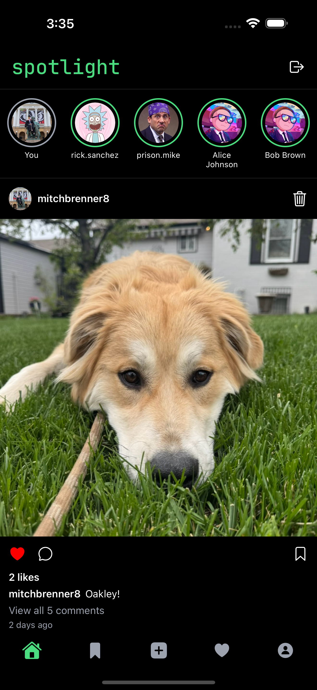
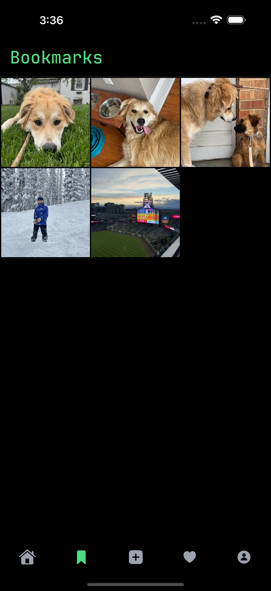
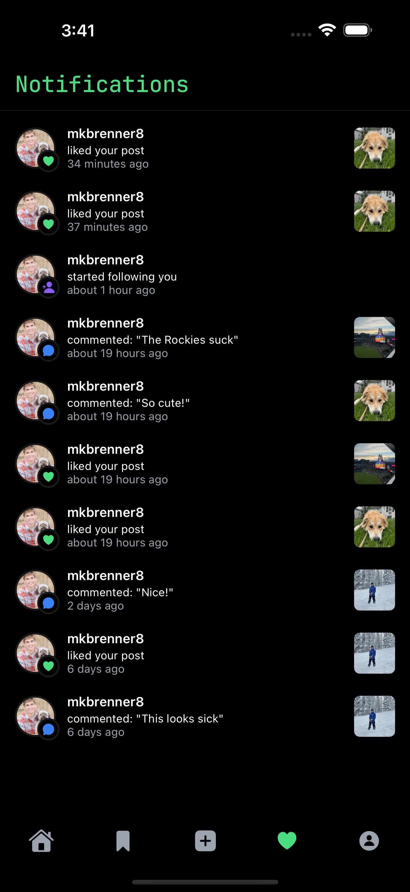

# Spotlight App 🔦

✨ A real-time, full-stack mobile experience inspired by Instagram—built with Expo and React Native. Users can post photos, comment, like, and follow each other, with everything updating instantly.

## 📱 Overview

Spotlight makes sharing moments effortless. Upload images, add captions, interact with friends’ posts, and watch your feed update live.

## 🔧 Tech Stack

- **Expo & React Native** for a cross-platform mobile UI
- **Clerk** for authentication, securely connected via SVIX-verified webhooks ([Clerk Docs](https://docs.clerk.dev))
- **Convex** for database storage and real-time sync, using HTTP Actions ([Convex HTTP Actions](https://docs.convex.dev/functions/http-actions))
- **SVIX** to ensure webhook authenticity and security ([SVIX Docs](https://www.svix.com/docs))
- **expo-image-picker** & **expo-image** for intuitive image selection and display ([ImagePicker](https://docs.expo.dev/versions/latest/sdk/imagepicker), [Image](https://docs.expo.dev/versions/latest/sdk/image))
- **expo-file-system** for performant media uploads ([FileSystem](https://docs.expo.dev/versions/latest/sdk/filesystem))
- **date-fns** for human-friendly date formatting ([date-fns](https://date-fns.org))

## 🚀 Key Features

- 🔄 **Real-Time Feed**: Instant updates for posts, comments, likes, and follows
- 📸 **Media**: Select photos, preview before posting, and smooth uploads
- 💬 **Interactive Community**: Comment, like, and follow
- 🔔 **Live Updates**: Comment and like in realtime
- 🔒 **Secure Auth**: Passwordless and social logins powered by Clerk, validated through SVIX

## 🌐 Important Links

- Convex HTTP Actions: https://docs.convex.dev/functions/http-actions
- Clerk Authentication: https://docs.clerk.dev
- SVIX Webhook Security: https://www.svix.com/docs
- Expo ImagePicker: https://docs.expo.dev/versions/latest/sdk/imagepicker
- Expo Image: https://docs.expo.dev/versions/latest/sdk/image
- Expo FileSystem: https://docs.expo.dev/versions/latest/sdk/filesystem
- date-fns Formatting: https://date-fns.org

## 📸 Screenshots

  
  
  
  

---

Enjoy exploring Spotlight! Feel free to reach out with any issues or feature requests. 💬
